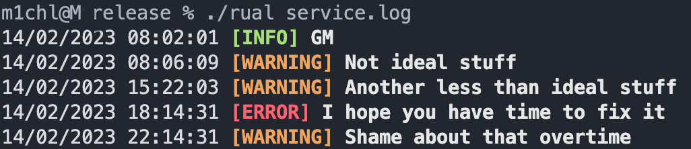

# Rust-a-Log



Rust a Log is a simple and efficient log viewer, made with the Rust programming language. 
It has a user-friendly interface, with real-time updating and color-coded log levels, making it easy to quickly identify and analyze your logs.

## Features
- **BUILD WITH RUST**
- Real-time updating of logs
- Color-coded log levels for quick identification
- User-friendly interface
- Supports multiple log levels (ERROR, WARNING, INFO)
- Works with any text-based log file

## Usage

To use Rust a Log, you first need to have somewhere in your log labels like this: 

```
[WARNING]
[ERROR]
[INFO]
[SUCCESS]
```

If these labels won't be present it will work like `tail -f` (just build for the future generations in RUST)

Simply run the binary with the path to the log file as an argument:

```
./rual path/to/log <optionalNumOfLines>
```

It can be also used with named arguments:

```
./rual -f path/to/log [--error -e] [--info -i] [--success -s] --follow -f
```

args mentioned in [] are filters, and --follow is for following the log file

The app will start by reading the last 10 lines (if not specified otherwise) of the log file, or all of the lines if the log file has less than 10 lines. The app will then continue to monitor the log file for new lines, updating the log output in real-time.

## Contributing

We welcome contributions to Rust a Log! If you have an idea for a new feature or have found a bug, feel free to open a pull request or issue on our GitHub repository.

## License

Rust a Log is open-source software, released under the MIT License. This means that you are free to use, modify, and distribute the software, as long as you include the original copyright and license notice.

## Disclaimer

I am fairly new to RUST, my first RUST Repo

## Future Plans
- [ ] Add more log filters
- [ ] Create rust library to produce the log file which this app can read
- [ ] Profit
