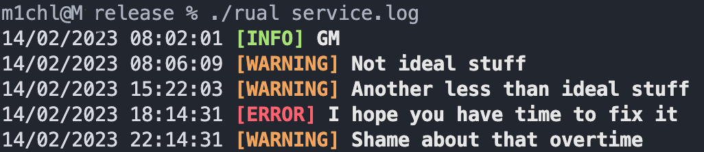

# Rust-a-Log

A small command-line log viewer: read recent records, filter them, and follow new writes. Large files are scanned backwards in 64 KiB blocks instead of being loaded into memory.



## Build and install

Install [Rust with rustup](https://rustup.rs/), then run from this repository:

```sh
cargo build --locked --release
# Optional: install rual into your Cargo bin directory
cargo install --locked --path .
```

The project pins **Rust 1.98.1**, uses edition 2024, and includes `Cargo.lock` for reproducible dependency resolution. Rustup installs the pinned compiler when you first build. The local binary is `target/release/rual` (`rual.exe` on Windows).

For a native Linux build, use the same commands on Linux. To cross-compile from macOS to x86-64 Linux, install [Zig](https://ziglang.org/download/) and [cargo-zigbuild](https://github.com/rust-cross/cargo-zigbuild), then run:

```sh
cargo install --locked cargo-zigbuild
./build_linux
```

The helper installs the Linux Rust target and writes `target/x86_64-unknown-linux-gnu/release/rual`. Missing tools and build errors produce a nonzero exit status. If linking fails, check your Zig and cargo-zigbuild versions; native builds do not need either tool.

## Usage

Put the file path first. By default, rual shows the last 10 records and follows new writes; press Ctrl+C to stop.

```sh
rual app.log                         # Last 10 records, then follow
rual app.log 50                      # Legacy positional count
rual app.log -n 50 --once            # Print last 50 records and exit
rual app.log -n 0                    # Only new records
rual app.log -e -w -n 20             # Last 20 errors OR warnings, then follow
rual app.log -g timeout --ignore-case --once
rual app.log -e -g database -n 5 --once
rual app.log --color never --once
rual --help
```

Counts apply **after filtering**: `-e -n 10` finds the last ten matching errors, even if they are scattered throughout the file. Multiple levels are combined with OR; the text search is an additional AND condition. Text search is literal, not a regular expression. `--ignore-case` compares lowercased Unicode text.

| Option | Meaning |
| --- | --- |
| `-n, --lines N` | Last N matching records; 0 skips existing content |
| `--once` | Print and exit |
| `-f, --follow [true\|false]` | Follow new writes; defaults to true |
| `-e, --errors [N]` | ERROR records |
| `-w, --warnings [N]` | WARN or WARNING records |
| `-i, --info [N]` | INFO records |
| `-s, --success [N]` | SUCCESS records |
| `-d, --debug [N]` | DEBUG records |
| `-t, --trace [N]` | TRACE records |
| `-g, --contains TEXT` | Literal text filter |
| `--ignore-case` | Case-insensitive text filter |
| `--color auto\|always\|never` | Auto respects terminal detection and NO_COLOR |

Legacy forms such as `rual app.log -e 20 --follow false` still work. `-n N` or positional N overrides the optional per-level counts. When combining legacy counts, the largest is used; a bare level flag contributes the default 10. Prefer `-n` when combining filters. A positional count and `-n` cannot be used together.

Compared with the original release, flags no longer switch between different reading modes: filtered invocations also follow by default. Add `--once` or `--follow false` to scripts that should terminate. `-f` means follow, not a file path.

## Records and following

One physical line is one record. Recognized labels are `[ERROR]`, `[WARNING]`, `[WARN]`, `[INFO]`, `[SUCCESS]`, `[DEBUG]`, and `[TRACE]`. The first recognized bracketed label determines the level, including after a bracketed timestamp. A word such as `ERROR` in ordinary message text is not a level; use `--contains ERROR` to search for it. Unlabelled records remain visible when no level filter is set.

- Handles empty files, CRLF line endings, long lines and malformed brackets. Invalid UTF-8 bytes display as replacement characters instead of crashing.
- Follow checks every 200 ms and keeps its last read position. Incomplete records wait for a newline, preserving UTF-8 characters split across writes. `--once` also prints a final line without a newline.
- Truncation below the current read position restarts at the beginning. Linux/macOS also reopen renamed or replaced logs, including after a temporary gap. Windows follows the original file handle and detects truncation; rename rotation requires restarting the viewer.
- Polling cannot detect every rewrite: a file truncated and regrown past the read position between polls can lose records. Writers should finish writing to an old rotated file before creating its replacement. An incomplete old record is discarded on detected truncation or rotation.
- Input must be a regular, seekable file. Pipes/stdin, compressed logs and multiline event grouping are not supported. Output can be piped; closing the receiving pipe exits cleanly.

Memory use is proportional to the longest record plus a small read buffer, not total file size. A rare filter may still need to scan the whole file to find enough matches; no index or cache is maintained.

## Performance

Local macOS ARM64 measurement on a 256 MiB log (2,097,152 records of 128 bytes), printing the last 10 matching errors:

| Release binary | Median elapsed time | Peak resident memory |
| --- | ---: | ---: |
| Original | 223 ms | 313 MiB |
| Updated | 6.3 ms | 1.9 MiB |

Five alternating runs after warming the file cache, measured with `/usr/bin/time -l` and a monotonic timer including process startup. Both binaries produced identical output; the old version requested nine records to compensate for its off-by-one bug. Results depend on the machine, disk and log format. A unit test separately enforces that fetching recent records never reads the old prefix.

## Logger library

The existing file logger is also available as a Rust library:

```rust,no_run
use rust_a_log::{Level, Logger};

fn main() -> std::io::Result<()> {
    let logger = Logger::new("app.log")?;
    logger.log_message("Application started", Level::Info)?;
    Ok(())
}
```

It appends timestamped records and supports `Trace`, `Debug`, `Info`, `Warn`, and `Error`.

## Development

```sh
cargo fmt --all --check
cargo test --locked
cargo clippy --locked --all-targets -- -D warnings
cargo build --locked --release
```

CI runs these checks on Linux, macOS and Windows. `src/main.rs` owns arguments, filtering and output; `src/tail.rs` owns file reading and following; `src/logger.rs` contains the library logger. Tests cover reverse scanning boundaries, bounded reads, CLI behavior, follow/truncation/Unix rotation and logger output without extra test dependencies.

For compiler updates, change `rust-toolchain.toml` and `package.rust-version` in `Cargo.toml`, then run the checks above. For dependency updates, run `cargo update`, review `Cargo.lock`, and run the checks before committing the lockfile.

## License

[MIT](LICENSE).
